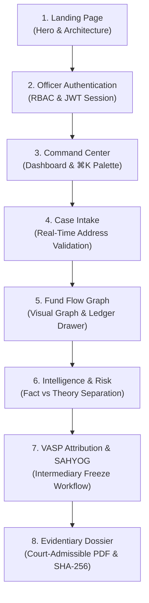

# ChainTrace — Executive Presentation & Live Demonstration Guide

This guide provides a comprehensive, step-by-step presentation script, interactive demo flow, and evaluation cheat sheet for showcasing **ChainTrace** to evaluators, judges, law enforcement officers, and technical stakeholders.

---

## 1. Executive Summary & Pitch (The 60-Second Hook)

> **"Cryptocurrency fraud has become the fastest-growing category of financial cybercrime, totaling tens of billions in victim losses annually. Yet law enforcement and compliance officers are slowed down by fragmented tools, opaque black-box AI scores that cannot withstand scrutiny in a court of law, and manual coordination with exchanges.**
> 
> **ChainTrace is a next-generation blockchain intelligence and asset recovery platform designed with Linear-level polish, Stripe-level clarity, and forensic cyber-investigation rigor. It automates multi-hop fund traversal across TRON and EVM chains, applies deterministic explainable risk heuristics, bridges statutory coordination with exchanges via I4C SAHYOG, and generates tamper-evident, court-admissible PDF dossiers stamped with SHA-256 cryptographic chain-of-custody digests."**

---

## 2. Pre-Demo Setup & Environment Checklist

Before beginning your demonstration, ensure the following services are active:

| Service | Port / URL | Status Check Command |
| :--- | :--- | :--- |
| **Backend API (FastAPI)** | `http://localhost:8000` | `curl -s http://localhost:8000/api/v1/health` |
| **Web Frontend (Vite)** | `http://localhost:5173` | `curl -s -I http://localhost:5173/` |
| **Active Environment** | Local `.env` | Configured with public RPC fallbacks |

### Recommended Demo Credentials
* **Role**: Lead Forensic Investigator (Level-3 Clearance)
* **Email**: `officer@chaintrace.internal`
* **Password**: `ChainTrace#2026` *(or `Investigator123!`)*

> [!TIP]
> Start your presentation on the public Landing Page (`http://localhost:5173/`) in **Dark Mode** for maximum visual contrast and cyber-intelligence aesthetics.

---

## 3. End-to-End Presentation Flow (8-Step Walkthrough)



---

### Step 1: The Landing Page & Mission
* **Target URL**: `http://localhost:5173/`
* **Actions**:
  1. Showcase the **ambient dynamic canvas network visualization** reacting in real time in the hero section.
  2. Scroll down to highlight the **Forensic Investigation Lifecycle** (*Intake → Traversal → Attribution → Legal Action*).
  3. Toggle the **Theme Switcher** (sun/moon icon) in the top navbar to demonstrate full, seamless light/dark theme adaptation without layout shifts.
* **Key Talking Points**:
  - *"Notice the visual standards: high-density cybersecurity typography, custom tokenized color palette, and clear visual hierarchy designed to reduce cognitive load during high-stress incident responses."*

---

### Step 2: Officer Authentication & Security Governance
* **Target URL**: `http://localhost:5173/login`
* **Actions**:
  1. Click **"Officer Sign In"** in the top navigation bar.
  2. Highlight that the login screen enforces real authentication with signed JWT bearer tokens and rate limiting (no client-side bypasses).
  3. Log in with `officer@chaintrace.internal` / `ChainTrace#2026`.
* **Key Talking Points**:
  - *"ChainTrace is built for law enforcement governance. Every session is cryptographically signed, role-restricted (Investigator, Admin, Analyst, Viewer), and logged to an immutable evidentiary audit trail."*

---

### Step 3: Investigator Command Center & Keyboard Palette
* **Target URL**: `http://localhost:5173/dashboard`
* **Actions**:
  1. Point to the **KPI Summary Row**: Active Cases, Traced Value in USDT, Identified VASP Clusters, and High-Risk Syndicates.
  2. Press **`⌘K`** (or `Ctrl+K`) to open the **Global Command Palette**.
  3. Type `Titan` or `NCRP` in the search bar to demonstrate instant fuzzy search and keyboard-driven navigation across cases and tools.
* **Key Talking Points**:
  - *"Investigators can navigate the entire platform without touching their mouse. The command palette allows instant switching between ongoing fraud cases and national portal integrations."*

---

### Step 4: Case Intake with Real-Time Address Validation
* **Target URL**: `http://localhost:5173/cases`
* **Actions**:
  1. Click **"+ New Case"** to trigger the case creation modal.
  2. Select **TRON** and enter an invalid wallet address (e.g., `T1234`): observe the real-time red warning (`Invalid Format`).
  3. Enter a valid TRON address (`TR7NHqjeKQxGTCi8q8ZY4pL8otSzgjLj6t`): observe the instant green checkmark (`Valid TRON`).
  4. Show the multi-chain selector supporting **Ethereum**, **BNB Smart Chain**, and **Polygon**.
* **Key Talking Points**:
  - *"Garbage in equals garbage out. ChainTrace validates cryptographic addresses in real time against Base58Check and EVM hex specifications, preventing flawed lookups before expensive graph queries are initiated."*

---

### Step 5: The Visual Fund Flow Graph (The Centerpiece)
* **Target URL**: Open **Operation Titan** (`CASE-2026-0881`) and click the **"Fund Flow"** tab.
* **Actions**:
  1. **Graph Canvas Navigation**: Pan across the multi-hop graph.
  2. **Role Color Encoding**:
     - 🔴 **Red Nodes**: Suspect seed wallets.
     - 🟣 **Purple Nodes**: Money mule intermediaries & peel chain forwarders.
     - 🔵 **Blue Nodes**: Verified Virtual Asset Service Provider (VASP) deposit endpoints.
  3. **Interactive Floating Toolbar**: Use **Zoom In**, **Zoom Out**, and **Fit to Screen**.
  4. **Node Forensics Modal**: Click on any wallet node to inspect its hop distance, connected transactions, and network chain.
  5. **Transaction Ledger Drawer**: Expand the bottom drawer to view the chronological ledger of transfers, hashes, and amounts with instant filtering.
* **Key Talking Points**:
  - *"This is our directed traversal engine. It automatically detects laundering patterns like peel chains and fan-out dispersion. Investigators can inspect individual hops, verify on-chain transaction hashes, and re-center the trace on newly discovered hubs with a single click."*

---

### Step 6: Intelligence Findings & Explainable Risk Engine
* **Target URL**: Click the **"Intelligence"** and **"Risk"** tabs in the workspace console.
* **Actions**:
  1. In **Intelligence Findings**, click on a flagged rule (e.g., *Rapid Forwarding* or *Peel Chain Dispersion*).
  2. Emphasize the two distinct forensic sections:
     - **1. Observed Blockchain Fact**: Raw transfer math, velocity (e.g., *98% funds forwarded within 84 seconds*).
     - **2. Forensic Interpretation**: The behavioral explanation for why this pattern indicates obfuscation.
  3. In the **Risk Engine**, demonstrate the explainable `0-100` score breakdown, category bounds (preventing double-counting), and the **Investigator Override** dialog for human-in-the-loop governance.
* **Key Talking Points**:
  - *"One of our fundamental design principles is the strict separation of Observed Fact from Forensic Interpretation. For court admissibility, an investigator must present incontrovertible cryptographic facts separately from investigative hypotheses. Furthermore, our risk score is mathematically bounded and explainable—never a black-box hallucination."*

---

### Step 7: VASP Attribution & SAHYOG Intermediary Coordination
* **Target URL**: Click the **"Attribution"** tab, then open **"National Integrations"** from the sidebar.
* **Actions**:
  1. View the identified destination exchanges (e.g., *Binance, WazirX, CoinDCX*).
  2. Under **National Integrations**, switch to the **SAHYOG VASP Requisitions** tab.
  3. Click **"New SAHYOG Requisition"** to simulate an inter-agency statutory request:
     - Select **Scenario 1 (SUCCESS - KYC Match)** to retrieve simulated verified account holder details.
     - Select **Scenario 3 (FREEZE_REQUEST_DEMO)** to simulate an emergency freezing order under Section 91 CrPC/BNSS.
  4. Inspect the generated requisition record and attached evidence reference.
* **Key Talking Points**:
  - *"Tracing fund flows is only half the battle; stopping the funds from cashing out is what recovers victim money. ChainTrace directly models the Indian I4C SAHYOG portal workflow, allowing investigators to generate standardized statutory requisitions to freeze accounts at registered exchanges."*

---

### Step 8: Court-Admissible PDF Dossiers & Cryptographic Custody
* **Target URL**: Navigate to **"Reports"** in the sidebar.
* **Actions**:
  1. Point out the list of generated dossiers and their **SHA-256 Cryptographic Hashes**.
  2. Click **"Generate Dossier"** for the active case, selecting whether to include transaction appendices.
  3. Download or preview the generated PDF dossier.
  4. Showcase the document layout: statutory header, case complaint references, multi-hop flow table, risk assessment, and chain-of-custody signature blocks.
* **Key Talking Points**:
  - *"Every investigation culminates in an official, court-admissible PDF dossier compiled via ReportLab. Each document is stamped with a SHA-256 digest, establishing an unalterable digital chain of custody compliant with statutory evidence requirements."*

---

## 4. Key Technical Differentiators to Emphasize

| Dimension | Typical Crypto Tools | ChainTrace Production Standard |
| :--- | :--- | :--- |
| **Design System** | Cluttered, generic crypto dark modes with neon cyan text and poor contrast | Unified token-based design system (`--ct-*`), full light/dark theme parity, Linear-level polish |
| **Forensic Epistemology** | Merges observed transactions with algorithmic guesses | Strict separation between **Observed Blockchain Facts** and **Forensic Interpretation** |
| **Risk Scoring** | Black-box ML models prone to hallucinations and unexplainable scores | Bounded 0–100 deterministic scoring with anti-double-counting category caps and human-in-the-loop override |
| **Multi-Chain Architecture** | Siloed single-chain implementations | Unified adapter interface supporting TRON (TRC-20) and generic EVM (Ethereum, BSC, Polygon) |
| **Legal Interoperability** | Disconnected from national law enforcement reporting portals | Native simulated integration with **NCRP** complaint intake and **I4C SAHYOG** statutory freeze workflows |
| **Evidentiary Integrity** | Simple screenshots or CSV exports | Court-admissible ReportLab PDF dossiers stamped with SHA-256 chain-of-custody digests |

---

## 5. Judge / Evaluator Q&A Cheat Sheet

### Q1: "How does ChainTrace handle false positives in risk scoring?"
> *"Our risk scoring engine implements strict category bounding and anti-double-counting rules. For example, high-volume deposit behavior to recognized exchanges (VASPs) is recognized as normal liquidation behavior rather than compounding illicit risk. Furthermore, every automated score can be overridden by an authorized investigator with an audited rationale."*

### Q2: "Can ChainTrace trace across different blockchains?"
> *"Yes. ChainTrace supports TRON (TRC-20 USDT) and generic EVM chains including Ethereum, Binance Smart Chain, and Polygon through standard JSON-RPC adapters, with Bitcoin UTXO architecture planned. Cross-chain bridging events are identified and correlated through linked case records."*

### Q3: "Can this system run in an air-gapped or secure sovereign environment?"
> *"Yes. ChainTrace has zero mandatory public cloud dependencies. It operates with local SQLite / PostgreSQL and an in-memory graph fallback, allowing full deployment in offline forensic labs or sovereign government data centers."*

### Q4: "What makes the generated reports court-admissible?"
> *"Under the Indian Evidence Act, Bharatiya Sakshya Adhiniyam (BSA), and IT Act Section 65B, electronic records require verification of source integrity. ChainTrace calculates an immutable SHA-256 cryptographic digest of the complete dossier upon generation, preventing retrospective tampering."*

---

## 6. Emergency Live-Demo Troubleshooting

* **If a local port is already in use**:
  ```bash
  lsof -i :5173  # Check web port
  lsof -i :8000  # Check API port
  ```
* **To reset the demo dataset**:
  ```bash
  npm run demo:reset
  ```
* **To run all quality gates before presenting**:
  ```bash
  bash scripts/test_all.sh
  ```
